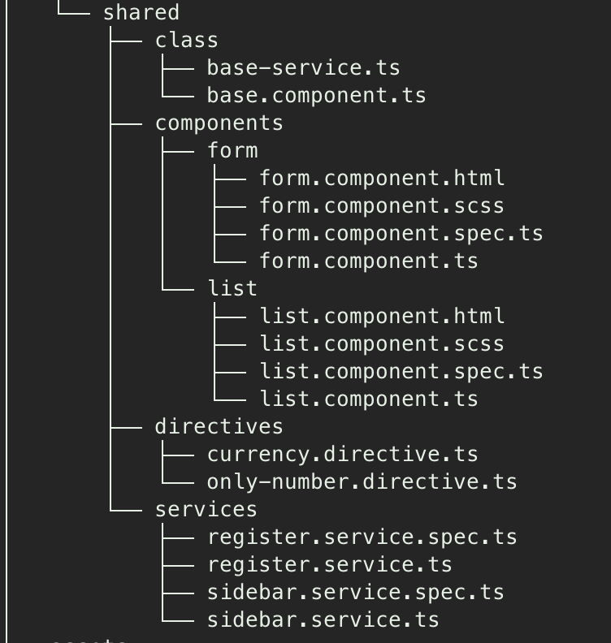
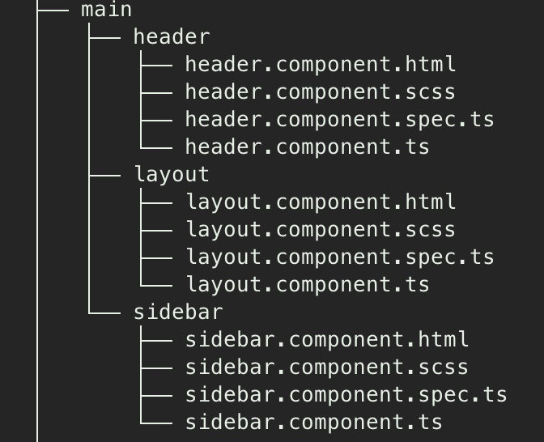
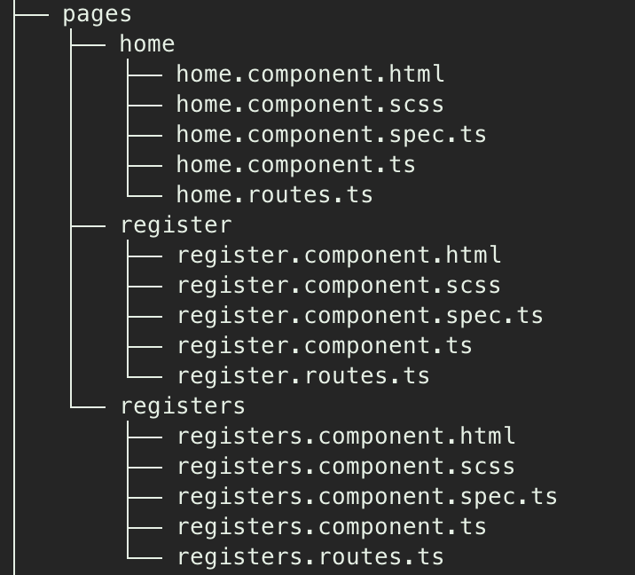
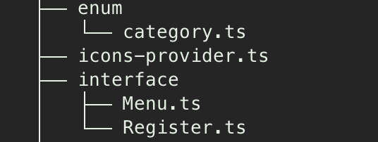

# Pre requisitos

[Angular CLI](https://github.com/angular/angular-cli) version 17.3.8.
Nodejs v20.11.0

## Servidor de desenvolvimento

Execute `ng serve` no terminal. Entre no link `http://localhost:4200/`

## Documentação
### Componentes compartilhados, classes, diretivas

### Components Layout

### Paginas

### Enum e interfaces

